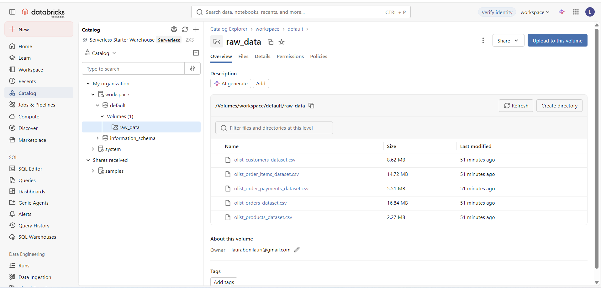
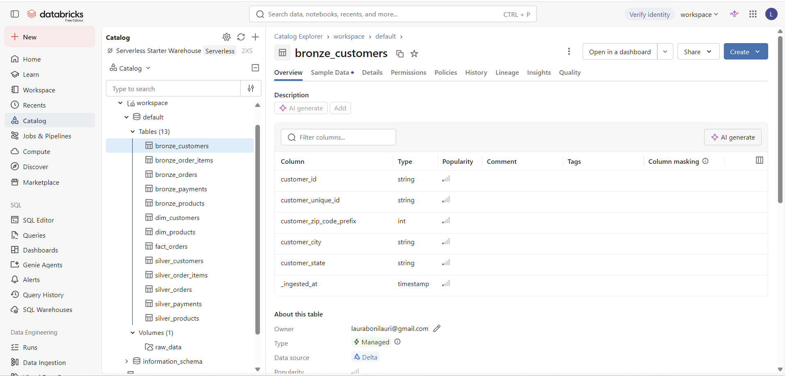
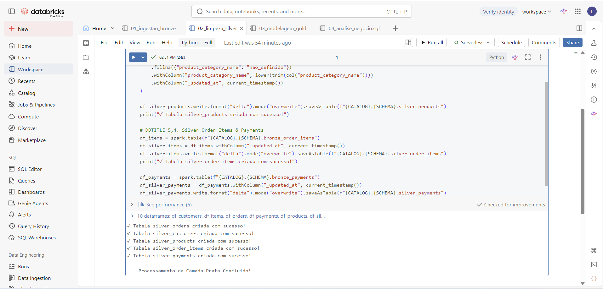
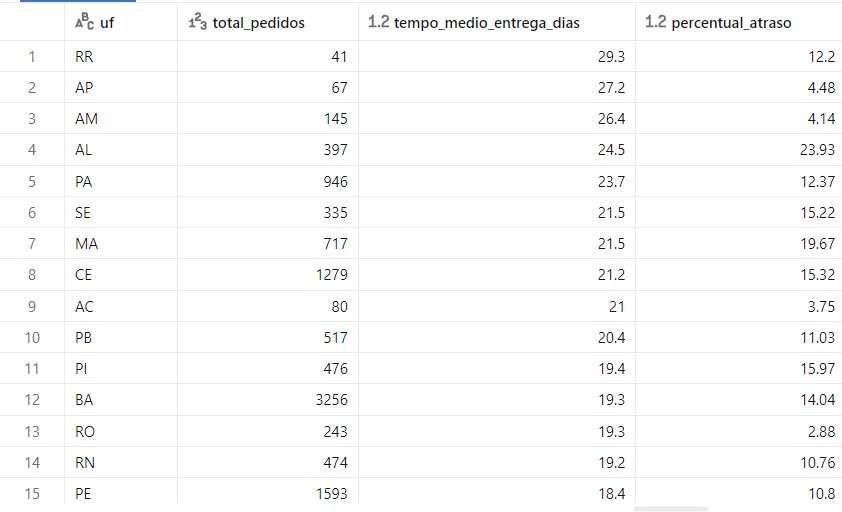
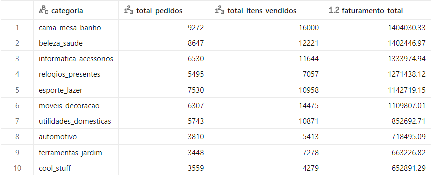
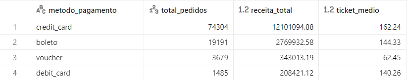

# MVP: Construção de um Pipeline de Dados na Nuvem (Databricks / Lakehouse)

> **Autor:** Laura Siebert Bonilauri  
> **Curso / Disciplina:** Engenharia de Dados  
> **Plataforma:** Databricks Free Edition (Apache Spark & Delta Lake)  

---

## 1. Contexto de Negócios e Perguntas (Etapa 2 e 4.1)

### Contexto do Problema
O objetivo deste projeto é analisar o desempenho operacional e logístico de uma operação de e-commerce brasileira. O dataset original contém registros de pedidos, clientes, produtos e pagamentos. 

A partir do armazenamento bruto até o refino em uma Arquitetura Medalhão (Bronze ➔ Silver ➔ Gold), o pipeline visa responder a dúvidas fundamentais sobre o nível de serviço de entrega, rentabilidade por categoria de produto e preferências de meios de pagamento.

### Perguntas de Negócio
1. **Logística por Estado (UF):** Qual é o tempo médio de entrega e qual é o percentual de atrasos de pedidos por estado brasileiro?
2. **Desempenho de Vendas:** Quais são as 10 categorias de produtos mais vendidas e qual o faturamento total gerado por cada uma?
3. **Comportamento Financeiro:** Qual é a distribuição das vendas por método de pagamento e o valor médio gasto (ticket médio) em cada modalidade?

### Estrutura dos Dados Brutos
A fonte de dados é composta por arquivos brutos no formato CSV:
- `orders`: Dados de pedidos (datas de compra, aprovação, envio e entrega).
- `customers`: Informações de localização dos clientes (cidade, estado, ID).
- `order_items`: Itens pertencentes a cada pedido (ID do produto, preço, frete).
- `products`: Catálogo de produtos (categorias, dimensões e pesos).
- `payments`: Transações financeiras dos pedidos (tipo de pagamento, parcelas, valor).

### Licença dos Dados
Os dados utilizados são disponibilizados sob a licença pública **CC0 1.0 Universal (Domínio Público)** / **Open Data Commons**, permitindo o uso acadêmico, comercial e de modificação sem restrições de direitos autorais.

---

## 2. Carga dos Dados (Etapa 4.2)

A carga inicial dos dados brutos foi realizada fazendo o upload dos arquivos CSV para o ambiente de nuvem do Databricks, armazenando-os diretamente em um **Volume do Unity Catalog** (`workspace.default.bronze_volume`).

Esse processo garante o armazenamento centralizado e persistente da camada **Bronze**, servindo como fonte imutável (dados exatamente como vieram da origem) para os processamentos posteriores com PySpark.

*Figura 1: Evidência dos arquivos brutos salvos no Volume do Databricks (Camada Bronze).*

---

## 3. Modelagem e Catálogo de Dados (Etapa 4.3)

O projeto adota a **Arquitetura Medalhão** dentro do conceito de **Data Lakehouse**:
- **Bronze:** Dados brutos em arquivos CSV armazenados no Volume.
- **Silver:** Tabelas Delta limpas, deduplicadas, padronizadas e tipadas (`silver_orders`, `silver_customers`, `silver_order_items`, `silver_products`, `silver_payments`).
- **Gold:** Tabelas modeladas em **Esquema Estrela (Star Schema)** otimizadas para consultas analíticas de negócio (`fact_orders`, `dim_customers`, `dim_products`).

### Catálogo de Dados (Unity Catalog)

#### Tabela Fato: `fact_orders` (Camada Gold)
- **Descrição:** Contém o consolidado de métricas operacionais e logísticas de cada pedido.
- `order_id` (STRING): Chave primária do pedido.
- `customer_id` (STRING): Chave estrangeira para a dimensão de clientes.
- `order_purchase_timestamp` (TIMESTAMP): Data e hora da compra.
- `delivery_time_days` (DOUBLE): Tempo total de entrega em dias.
- `is_delayed` (INT): Flag booleana indicando se a entrega atrasou (`1` = Sim, `0` = Não).
- `total_items` (INT): Quantidade de itens no pedido.
- `total_products_value` (DOUBLE): Valor total dos produtos do pedido em BRL.

#### Tabela Dimensão: `dim_customers` (Camada Gold)
- **Descrição:** Informações geográficas dos clientes.
- `customer_id` (STRING): Chave primária do cliente.
- `customer_city` (STRING): Cidade do cliente.
- `customer_state` (STRING): Unidade Federativa (UF) do cliente (domínio: 27 UFs do Brasil).

#### Tabela Dimensão: `dim_products` (Camada Gold)
- **Descrição:** Cadastro e categorização das mercadorias.
- `product_id` (STRING): Chave primária do produto.
- `product_category_name` (STRING): Nome padronizado da categoria do produto.

  
*Figura 2: Estrutura do modelo de dados e tabelas persistidas no catálogo do Databricks.*

---

## 4. Pipeline de Dados (Etapa 4.4)

O pipeline ETL (Extract, Transform, Load) foi desenvolvido em linguagem **PySpark** e **SQL** no Databricks, estruturado em módulos claros de transformação:

1. **Camada Bronze ➔ Silver:** 
   - Leitura dos arquivos CSV do Volume.
   - Tratamento de valores nulos e remoção de registros duplicados.
   - Conversão de tipos de dados (Strings de datas convertidas para `TimestampType`).
   - Padronização de textos e categorias.
   - Salvamento no formato **Delta Lake** na camada Silver.

2. **Camada Silver ➔ Gold:**
   - Cálculo de regras de negócio: cálculo da diferença em dias entre a data do pedido e a entrega realizada (`delivery_time_days`), e verificação de atraso logístico (`is_delayed`).
   - Agregação de valores de itens e frete por pedido.
   - Criação e persistência das tabelas Fato e Dimensão na camada Gold.

*Scripts completos do pipeline:*
- [`notebooks/01_bronze_to_silver.py`](./notebooks)
- [`notebooks/02_silver_to_gold.py`](./notebooks)

  
*Figura 3: Execução bem-sucedida das células de código salvando as tabelas Delta na nuvem.*

---

## 5. Qualidade de Dados (Etapa 4.5)

Durante a fase de diagnóstico e refino da camada Silver, foram identificados e tratados os seguintes aspectos de qualidade:

- **Completude:** Identificados valores nulos nas colunas de datas de entrega (`order_delivered_customer_date`). Pedidos com entregas não concluídas/canceladas foram filtrados para a análise de tempo logístico.
- **Consistência e Tipagem:** Os campos de datas originais do CSV vieram formatados como texto e foram convertidos nativamente para `TimestampType` no PySpark, permitindo cálculos de intervalo de datas (`datediff`).
- **Unicidade:** Removidas duplicatas de clientes e produtos garantindo a integridade referencial do Esquema Estrela (chaves primárias únicas nas dimensões).
- **Tratamento de Categóricos:** Padronização das siglas de estados (UF) em maiúsculas e preenchimento de nomes de categorias ausentes com o rótulo `'outros'`.

---

## 6. Análise de Dados (Etapa 4.5)

Abaixo estão as consultas SQL executadas na camada Gold para responder às perguntas do objetivo do projeto:

### 1. Tempo Médio de Entrega e Taxa de Atraso por Estado (UF)

 
Figura 4: Resultado da análise logística por UF gerado no Databricks.

Discussão dos Resultados:
A análise revela uma forte assimetria logística no Brasil. Estados da Região Norte, como Roraima (RR) e Amapá (AP), apresentam os maiores tempos médios de entrega (29,3 e 27,2 dias, respectivamente). Em contrapartida, estados do Sul e Sudeste possuem prazos substancialmente menores. O percentual de atrasos também varia drasticamente, atingindo picos de mais de 23% em determinados estados do Nordeste (ex: Alagoas), apontando gargalos na malha de distribuição regional.

### 2. Top 10 categorias faturamentos

Figura 5: Resultado da análise de faturamento por categorias.

Discussão dos Resultados:
As categorias ligadas a bens de consumo duráveis e decoração de interiores lideram a receita total do e-commerce. As categorias "Beleza & Saúde", "Cama, Mesa e Banho" e "Informática & Acessórios" concentram o maior volume absoluto de vendas e faturamento, demonstrando onde a empresa deve focar seus investimentos em marketing e estoque.

### 3. Distribuição dos métodos de pagamento e ticket médio

Figura 6: Resultado da análise de métodos de pagamento e ticket médio.

Discussão dos Resultados:
O cartão de crédito domina amplamente a preferência dos consumidores em receita total e volume de transações, seguido pelo boleto bancário. O ticket médio das compras efetuadas via cartão de crédito e cartão de débito indica diferenças de perfil de compra: transações parceladas no cartão de crédito viabilizam pedidos de maior valor agregado.

## Autoavaliação

### Atingimento dos Objetivos
O objetivo principal de construir um pipeline de dados ponta a ponta na nuvem utilizando o Databricks e o conceito de Lakehouse foi totalmente atingido. O fluxo completo desde a ingestão dos dados brutos no Volume até a modelagem analítica e execução das consultas SQL foi concluído com sucesso.

### Dificuldades Encontradas
- Configuração de Sintaxe e Ambientes: Ajuste na execução de células SQL no Databricks, solucionando pequenos erros de recuo (IndentationError) e padronização de comentários em SQL (-- em vez de #).

- Tratamento de Datas: Necessidade de conversão criteriosa de colunas de data/hora armazenadas originalmente como strings na camada Bronze para cálculo correto dos dias de entrega na camada Gold.

### Trabalhos Futuros
Para enriquecimento deste projeto em um portfólio profissional, planeja-se:

- Implementar rotinas automatizadas de refras de ingestão com Databricks Auto Loader ou fluxos agendados via Databricks Workflows (Jobs).

- Conectar a camada Gold a um painel interativo de Business Intelligence no Power BI para visualização gráfica dinâmica dos KPIs logísticos e comerciais.

- Adicionar testes automatizados de qualidade de dados usando bibliotecas como Great Expectations.
